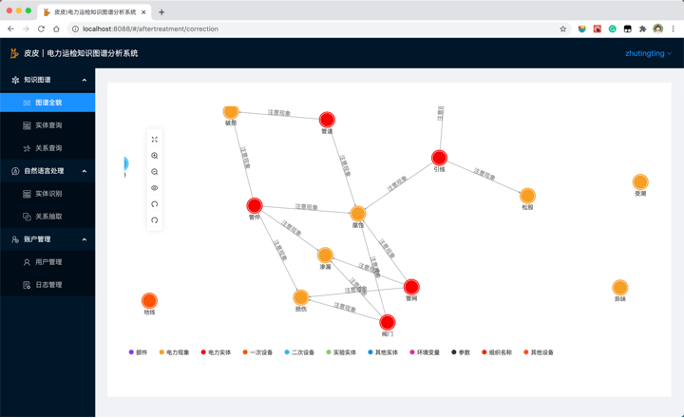
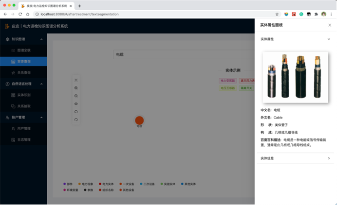
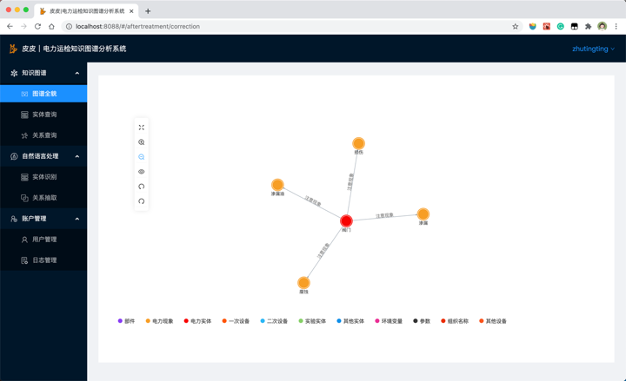
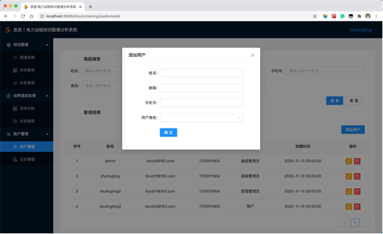
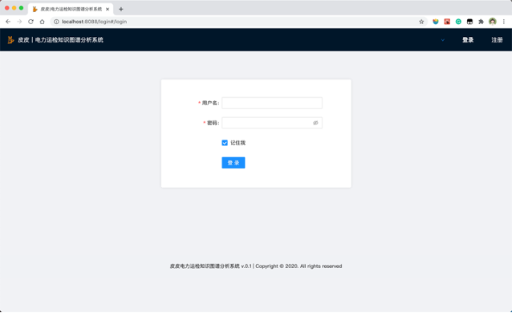

# 皮皮电力运检知识图谱管理系统--前端

项目路径：
- config webpack配置文件
- public 公共文件
- scripts 项目命令脚本
- src 项目资源
    - components 通用组件
    - pages 页面组件
    - router 路由配置
    - statics 静态文件
    - store 全局状态存储
    - utils 工具包
        - ajax.js 异步请求配置文件
- App.js 应用入口文件
- index.js 项目入口文件
- style.js 全局样式文件
- .gitignore git忽略文件
- package.json 项目依赖文件
- package-lock.json 项目依赖版本锁文件

项目启动方法：
1. 进入项目文件夹
2. yarn i 安装项目依赖
3. yarn start 启动项目
4. 浏览器访问 http://localhost:3000/

本系统功能展示图如下：

本项目只是纯前端项目。 
访问后端项目请到 [power-kg-node](https://github.com/lionztt/power-kg-node)。 
访问知识图谱项目请到 [electric-power](https://github.com/bupt-mmai/electric-power)

